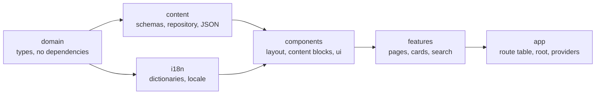

# my-portfolio-web

> A bilingual (ES/EN), statically prerendered developer portfolio built with React 19, React Router 8, TypeScript and Tailwind CSS 4, driven by validated JSON content.

[](https://github.com/eliangilsierra/my-portfolio-web/actions/workflows/ci.yml)
[](https://github.com/eliangilsierra/my-portfolio-web/actions/workflows/codeql.yml)
[](https://github.com/eliangilsierra/my-portfolio-web/actions/workflows/deploy.yml)
[](LICENSE)


> **Sample data.** Every name, link, metric and project in `src/content/data/` is placeholder content used to demonstrate the site. Replace it with your own before publishing (see [Editing content](#editing-content)).

**Live site:** `https://eliangilsierra.github.io/my-portfolio-web/` (available once GitHub Pages is enabled, see [Deployment](#deployment)).

## Screenshots

> Add screenshots to `docs/screenshots/` and reference them here.
>
> | Home          | Projects      | Project detail |
> | ------------- | ------------- | -------------- |
> | _placeholder_ | _placeholder_ | _placeholder_  |

## Why this project exists

**Problem.** Developer portfolios tend to end up in one of two places: a hand-coded page that is painful to update, or a template whose content is tangled with its markup. Bilingual sites make it worse, because every text ends up duplicated across components, and single-page apps hide their content from search engines and social previews.

**Purpose.** Treat a portfolio as _content plus a small, well-tested rendering layer_. All content lives in typed, validated JSON with a translation for every supported language, and every page is rendered to real HTML at build time, so updating the site never requires touching a component and the result is fast, indexable and accessible.

**Target users.** Developers who want a fast, accessible, static portfolio in two languages that they can host for free, and recruiters or clients who read it.

**Goals**

- Content edits are data edits: a missing translation or a broken URL fails the build, not the UI.
- Accessible and responsive by default, and _proven_ by automated checks in a real browser.
- Zero backend: it deploys as static files to GitHub Pages.
- Small surface area that is easy to read, test and extend.

## Features

- **Bilingual (ES/EN) with the language in the URL** (`/es/projects`, `/en/projects`): shareable, crawlable, with `hreflang` alternates. The site root sends visitors to their browser language.
- **Prerendered to static HTML**: every page and language is real HTML before any JavaScript runs, with per-page title, description, canonical URL, Open Graph tags and a sitemap.
- **Projects** with accent-insensitive search, type filters, image gallery and detail pages.
- **Knowledge pills**: short technical notes with code blocks, callouts and newer/older navigation.
- **About page** with skills, certifications and a timeline.
- **Contact form** built on React 19 form actions, with localized validation, running in demo mode until a provider is connected.
- **Light / dark / system theme** applied before first paint, so there is no flash.
- **Strict Content-Security-Policy** generated per page from the scripts it actually contains, no third-party requests, self-hosted fonts.
- **Validated content**: schemas reject missing translations, duplicate slugs, malformed dates and URLs when the build or dev server starts.

## Quality, measured

These numbers come from the checks that run in CI; the Lighthouse figures were measured locally on 2026-09-29 against the production build, served with gzip like GitHub Pages does (mobile profile with simulated slow 4G), and vary by machine.

| Area                   | Result                                                                                      |
| ---------------------- | ------------------------------------------------------------------------------------------- |
| Unit and integration   | 163 tests, ~99% line coverage (thresholds enforced)                                         |
| End to end (real Chrome) | 114 tests: accessibility with axe (contrast included) in light and dark, both languages, desktop and mobile; CSP; no-JS rendering; 404s; forms |
| Lighthouse (mobile)    | Performance 91–92, Accessibility 100, Best Practices 100, SEO 100                            |
| First-load JavaScript  | ~156 kB gzip for the home page (budget enforced), CSS ~8 kB gzip                            |
| Dependencies           | 13 runtime packages; `npm audit` reports 0 vulnerabilities                                  |
| Type safety            | TypeScript strict, type-aware ESLint, architecture layers enforced by lint                  |

## Architecture overview

The app is organized by feature, with a framework-free `domain` layer at the bottom and the route table at the top. Each layer may only import from the layers below it, and ESLint enforces it.



Read more in [docs/architecture.md](docs/architecture.md) and the decision log in [docs/decisions.md](docs/decisions.md).

## Tech stack

| Area            | Choice                                                                                          |
| --------------- | ----------------------------------------------------------------------------------------------- |
| Language        | TypeScript 6 (`strict`, `noUncheckedIndexedAccess`)                                             |
| UI              | React 19, Tailwind CSS 4, shadcn/ui-style primitives (Radix), CSS scroll-driven animations      |
| Routing         | React Router 8 in framework mode, prerendered with `ssr: false`                                 |
| Forms and data  | React 19 form actions, Zod 4                                                                    |
| Build           | Vite 8 (Rolldown)                                                                               |
| Quality         | ESLint 10 (type-aware, `jsx-a11y`), Prettier, Vitest 5, Testing Library, Playwright, axe-core, knip, Lighthouse |
| CI / Deployment | GitHub Actions (actions pinned by SHA), CodeQL, Dependabot, release-please, GitHub Pages        |

## Getting started

**Requirements:** Node.js 22.22 or newer (24 LTS recommended, see `.nvmrc`) and npm.

```bash
git clone https://github.com/eliangilsierra/my-portfolio-web.git
cd my-portfolio-web
npm ci
npm run dev
```

The dev server runs at <http://localhost:8080>. `npm ci` also installs the git hooks (lint-staged, type-check and Conventional Commits) through `lefthook`.

### Environment variables

Copy `.env.example` to `.env.local` to override defaults.

| Variable         | Default | Description                                                                                                                                                                  |
| ---------------- | ------- | ---------------------------------------------------------------------------------------------------------------------------------------------------------------------------- |
| `VITE_BASE_PATH` | `/`     | Path the site is served from. Use `/<repository-name>/` for a GitHub Pages project site. Omit it for a custom domain.                                                         |
| `VITE_SITE_URL`  | empty   | Public address of the deployed site including the base path (for example `https://user.github.io/repo`). Enables canonical, hreflang and social tags and the sitemap. |

No secrets are required. Never commit `.env*` files other than `.env.example`.

### Available scripts

| Script                  | Description                                                                              |
| ----------------------- | ---------------------------------------------------------------------------------------- |
| `npm run dev`           | Start the React Router dev server                                                        |
| `npm run build`         | Prerender every page to `build/client` and post-process it (404 page, CSP, sitemap)      |
| `npm run preview`       | Serve `build/client` with GitHub Pages semantics (base path, gzip, 404 status)           |
| `npm run lint`          | Run ESLint (type-aware, accessibility and architecture rules)                            |
| `npm run typecheck`     | Run the TypeScript compiler without emitting                                             |
| `npm test`              | Run the unit and integration tests once                                                  |
| `npm run test:coverage` | Run them with coverage and fail below the thresholds                                     |
| `npm run e2e`           | Build under a base path and run the Playwright suite in a real browser                   |
| `npm run knip`          | Report unused files, exports and dependencies                                            |
| `npm run format`        | Format the repository with Prettier                                                      |
| `npm run verify`        | Everything CI runs, in order, except the e2e and Lighthouse jobs                         |

## Editing content

Content lives in `src/content/data/`:

| File            | Contents                                           |
| --------------- | -------------------------------------------------- |
| `about.json`    | Name, links, skills, certifications, timeline, bio |
| `projects.json` | Portfolio projects                                 |
| `pills.json`    | Knowledge pills (short articles)                   |

Each entity carries its shared data (slug, tech, dates, URLs) once and its text under `translations.es` / `translations.en`. Body text is an array of typed blocks: `h2`, `h3`, `p`, `ul`, `callout` and `code`. Images go in `public/images/` and are referenced relative to it.

Validation runs when the dev server or the build starts, so it tells you exactly which field is wrong. See [docs/development.md](docs/development.md#adding-content) for a worked example.

## Testing

```bash
npm test          # unit and integration, in jsdom
npm run e2e       # real browser against the production build
```

The unit suite covers the content schema and repository, search, formatting helpers, the contact form logic, metadata for every route, error boundaries and application flows (routing, language, 404s, filtering, theme). The e2e suite is the one that checks what jsdom cannot: colour contrast, the Content-Security-Policy, that pages are readable before scripts load, and the real 404 responses.

## Deployment

The site deploys to **GitHub Pages** from `main` through [`.github/workflows/deploy.yml`](.github/workflows/deploy.yml).

1. In the repository settings, open **Pages** and set the source to **GitHub Actions**.
2. Push to `main`. The workflow runs the tests, builds with the base path and site URL derived from the repository, verifies the output (`scripts/verify-build.mjs`) and publishes `build/client`.

Pages returns `404.html` for unknown addresses; the build turns the framework's SPA fallback into that page, so links to routes that were not prerendered still work and answer with a real 404 status. For a custom domain, remove `VITE_BASE_PATH` from the workflow and set `VITE_SITE_URL` to that domain.

For releases, [release-please](https://github.com/googleapis/release-please) keeps a release pull request up to date from the Conventional Commits on `main`; enable **Allow GitHub Actions to create and approve pull requests** in the repository settings for it to work.

To reproduce a Pages build locally on Windows Git Bash, prefix the command with `MSYS_NO_PATHCONV=1` so the leading slash is not rewritten.

## Project structure

```text
.
├── .github/                # CI, deployment, release, CodeQL, issue and PR templates
├── docs/                   # Architecture, development guide, decision records
├── e2e/                    # Playwright tests (real browser)
├── public/                 # Static assets served as-is (images, robots.txt, social image)
├── scripts/                # Build tooling: postbuild, verification, preview, e2e runner
└── src/
    ├── app/                # Route table, root document, providers, route modules and SEO metadata
    ├── components/         # Shared UI: layout, content blocks, motion, icons, ui primitives
    ├── config/             # Constants, routes, environment and site identity
    ├── content/            # Schemas, repository, JSON data and providers
    ├── domain/             # Framework-free types (locale, project, pill, about, content blocks)
    ├── features/           # home, projects, pills, about, contact, landing, not-found
    ├── i18n/               # Dictionaries, locale detection, provider
    ├── lib/                # Pure helpers (formatting, text, mailto, logging)
    ├── services/           # Ports to the outside world (contact delivery)
    ├── test/               # Test setup and render helpers
    └── theme/              # Light/dark theme (inline head script and hook)
```

## Roadmap

- [ ] Replace the sample content with real projects and biography
- [ ] Connect a real contact provider behind `ContactService`
- [ ] Load only the active language's dictionary and content (saves ~20 kB gzip)
- [ ] Syntax highlighting for code blocks
- [ ] TypeScript 7 once `typescript-eslint` supports it
- [ ] Real project screenshots instead of generated placeholders

## Contributing

Contributions are welcome. Please read [CONTRIBUTING.md](CONTRIBUTING.md) first, and note the [Code of Conduct](CODE_OF_CONDUCT.md) and [Security Policy](SECURITY.md).

## License

Released under the [MIT License](LICENSE).
