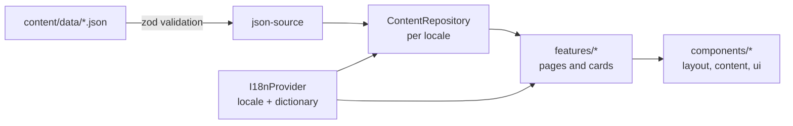

# my-portfolio-web

> A bilingual (ES/EN), JSON-driven developer portfolio built with React, TypeScript and Tailwind CSS.

[](https://github.com/eliangilsierra/my-portfolio-web/actions/workflows/ci.yml)
[](https://github.com/eliangilsierra/my-portfolio-web/actions/workflows/deploy.yml)
[](LICENSE)


> **Sample data.** Every name, link, metric and project in `src/content/data/` is placeholder content used to demonstrate the site. Replace it with your own before publishing (see [Editing content](#editing-content)).

**Live site:** `https://eliangilsierra.github.io/my-portfolio-web/` (available once GitHub Pages is enabled, see [Deployment](#deployment)).

## Screenshots

> Add screenshots to `docs/screenshots/` and reference them here.
>
> | Home | Projects | Project detail |
> | ---- | -------- | -------------- |
> | _placeholder_ | _placeholder_ | _placeholder_ |

## Why this project exists

**Problem.** Developer portfolios tend to end up in one of two places: a hand-coded page that is painful to update, or a template whose content is tangled with its markup. Bilingual sites make it worse, because every text ends up duplicated across components.

**Purpose.** Treat a portfolio as _content plus a small, well-tested rendering layer_. All content lives in typed, validated JSON with a translation for every supported language, so updating the site never requires touching a component.

**Target users.** Developers who want a fast, accessible, static portfolio in two languages that they can host for free, and recruiters or clients who read it.

**Goals**

- Content edits are data edits: a missing translation or a broken URL fails validation, not the UI.
- Accessible and responsive by default (skip link, landmarks, keyboard navigation, reduced motion).
- Zero backend: it deploys as static files to GitHub Pages.
- Small surface area that is easy to read, test and extend.

## Features

- **Bilingual UI (ES/EN)** with browser-language detection, persisted preference and `<html lang>` updates.
- **Projects** with full-text search (accent-insensitive), type filters, image gallery and detail pages.
- **Knowledge pills**: short technical notes with code blocks, callouts and newer/older navigation.
- **About page** with skills, certifications and a timeline.
- **Contact form** with localized validation, running in demo mode until a provider is connected.
- **Light / dark / system theme** without a flash on load.
- **Validated content**: schemas reject missing translations, duplicate slugs, malformed dates and URLs.
- **Route-level code splitting** and an error boundary.

## Architecture overview

The app is organized by feature, with content and language as cross-cutting layers. Pages depend on the `ContentRepository` interface and never on the JSON files directly.



Read more in [docs/architecture.md](docs/architecture.md) and the decision log in [docs/decisions.md](docs/decisions.md).

## Tech stack

| Area            | Choice                                                          |
| --------------- | --------------------------------------------------------------- |
| Language        | TypeScript 5 (`strict`, `noUncheckedIndexedAccess`)             |
| UI              | React 18, Tailwind CSS 3, shadcn/ui primitives, Framer Motion   |
| Routing         | React Router 6 (`BrowserRouter`, lazy routes)                   |
| Forms and data  | React Hook Form, Zod                                            |
| Build           | Vite 5 with the SWC React plugin                                |
| Quality         | ESLint 9 (with `jsx-a11y`), Prettier, Vitest 3, Testing Library |
| CI / Deployment | GitHub Actions, GitHub Pages                                    |

## Getting started

**Requirements:** Node.js 20 or newer and npm.

```bash
git clone https://github.com/eliangilsierra/my-portfolio-web.git
cd my-portfolio-web
npm ci
npm run dev
```

The dev server runs at <http://localhost:8080>.

### Environment variables

Copy `.env.example` to `.env.local` to override defaults.

| Variable         | Default | Description                                                                                                               |
| ---------------- | ------- | ------------------------------------------------------------------------------------------------------------------------- |
| `VITE_BASE_PATH` | `/`     | Path the site is served from. Use `/<repository-name>/` for a GitHub Pages project site. Omit it for a custom domain. |

No secrets are required. Never commit `.env*` files other than `.env.example`.

### Available scripts

| Script                 | Description                                              |
| ---------------------- | -------------------------------------------------------- |
| `npm run dev`          | Start the Vite dev server                                |
| `npm run build`        | Type-check, build to `dist/` and create the `404.html` fallback |
| `npm run preview`      | Serve the production build locally                       |
| `npm run lint`         | Run ESLint                                               |
| `npm run typecheck`    | Run the TypeScript compiler without emitting             |
| `npm test`             | Run the test suite once                                  |
| `npm run test:watch`   | Run tests in watch mode                                  |
| `npm run format`       | Format the repository with Prettier                      |
| `npm run format:check` | Verify formatting (used in CI)                           |

## Editing content

Content lives in `src/content/data/`:

| File            | Contents                                            |
| --------------- | --------------------------------------------------- |
| `about.json`    | Name, links, skills, certifications, timeline, bio  |
| `projects.json` | Portfolio projects                                  |
| `pills.json`    | Knowledge pills (short articles)                    |

Each entity carries its shared data (slug, tech, dates, URLs) once and its text under `translations.es` / `translations.en`. Body text is an array of typed blocks: `h2`, `h3`, `p`, `ul`, `callout` and `code`. Images go in `public/images/` and are referenced relative to it.

Validation runs on load, so the dev server and the tests tell you exactly which field is wrong. See [docs/development.md](docs/development.md#adding-content) for a worked example.

## Testing

```bash
npm test
```

The suite covers the content schema and repository, search, formatting helpers, the content renderer, the contact form (validation, success and failure paths) and application-level flows (routing, 404s, filtering, language switching, accessibility landmarks).

## Deployment

The site deploys to **GitHub Pages** from `main` through [`.github/workflows/deploy.yml`](.github/workflows/deploy.yml).

1. In the repository settings, open **Pages** and set the source to **GitHub Actions**.
2. Push to `main`. The workflow runs the tests, builds with `VITE_BASE_PATH=/<repository-name>/` and publishes `dist/`.

Deep links work because the build copies `index.html` to `404.html`, which Pages serves for unknown paths. For a custom domain, remove `VITE_BASE_PATH` from the workflow.

To reproduce a Pages build locally on Windows Git Bash, prefix the command with `MSYS_NO_PATHCONV=1` so the leading slash is not rewritten.

## Project structure

```text
.
├── .github/                # CI, deployment, issue and PR templates
├── docs/                   # Architecture, development guide, decision records
├── public/                 # Static assets served as-is (images, robots.txt)
├── scripts/                # Build helper scripts
└── src/
    ├── app/                # Providers, router and application shell
    ├── components/         # Shared UI: layout, content blocks, motion, ui primitives
    ├── config/             # Constants, routes, environment and site identity
    ├── content/            # Schemas, repository, JSON data and providers
    ├── features/           # home, projects, pills, about, contact, not-found
    ├── hooks/              # Reusable hooks
    ├── i18n/               # Locales, dictionaries and provider
    ├── lib/                # Pure helpers (formatting, text, mailto, logging)
    └── test/               # Test setup and render helpers
```

## Roadmap

- [ ] Replace the sample content with real projects and biography
- [ ] Connect a real contact provider behind `ContactService`
- [ ] Add an Open Graph image and a sitemap
- [ ] Self-host fonts to remove the third-party request
- [ ] Syntax highlighting for code blocks
- [ ] Pre-render routes (static generation) for correct HTTP status codes and richer SEO
- [ ] Upgrade to Vite 6+ and Vitest 5

## Contributing

Contributions are welcome. Please read [CONTRIBUTING.md](CONTRIBUTING.md) first.

## License

Released under the [MIT License](LICENSE).
