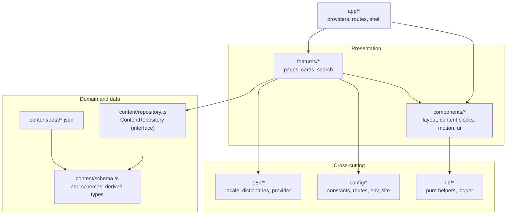
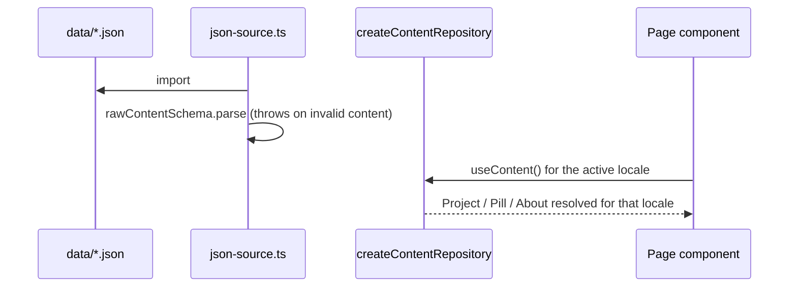

# Architecture

This document explains how my-portfolio-web is structured and why. For individual decisions and their trade-offs, see [decisions.md](decisions.md).

## Principles

| Principle                        | How it shows up                                                                                                           |
| -------------------------------- | ------------------------------------------------------------------------------------------------------------------------- |
| Separation of concerns           | Content, language, configuration, presentation and routing live in separate modules.                                      |
| Dependency inversion             | Pages depend on the `ContentRepository` and `ContactService` interfaces, not on JSON files or a mock.                     |
| High cohesion, low coupling      | Each feature folder owns its page, cards and search logic. Shared code moves to `components/`, `lib/` or `config/`.        |
| DRY                              | One hero component, one reveal animation, one route table, one constants file, one date formatter.                        |
| KISS / YAGNI                     | A tiny custom i18n instead of a library, no global state store, no backend, no data-fetching layer.                        |
| Type safety                      | `strict` TypeScript; content types derive from Zod schemas; dictionaries are checked against the English shape.            |
| Fail fast                        | Invalid content throws with a readable message at load time; unknown render cases fail an exhaustive `never` check.         |

## Layers

Dependency direction: `app` → `features` → `components` → `lib`/`config`. Nothing in `content/` imports from `features/` or `components/`.

## Folder responsibilities

| Path                   | Responsibility                                                                                   |
| ---------------------- | ------------------------------------------------------------------------------------------------ |
| `src/app`              | Composition root: providers, lazy route table, router-agnostic shell, `BrowserRouter` wiring.    |
| `src/features/<name>`  | A vertical slice: its pages, cards and feature-specific logic (for example project search).       |
| `src/components`       | Reusable UI with no knowledge of a specific feature.                                             |
| `src/components/ui`    | shadcn/ui primitives (generated style, edited sparingly).                                        |
| `src/content`          | Schemas, domain types, repository interface and implementation, JSON data, React providers.      |
| `src/i18n`             | Supported locales, typed dictionaries, provider and `useI18n` hook.                              |
| `src/config`           | Constants, route table, environment access and site identity.                                    |
| `src/lib`              | Framework-free helpers: date formatting, text normalization, mailto builder, logger.             |

## Content pipeline

1. `json-source.ts` validates all JSON once at module load. A malformed file fails the dev server, the tests and the build immediately.
2. `createContentRepository(raw, locale)` projects the localized fields (title, excerpt, content blocks, alt texts) and sorts entities newest first.
3. `ContentProvider` rebuilds the repository whenever the locale changes, so pages never branch on the language.

To move content to a CMS or API, implement `ContentRepository` and pass it to `ContentProvider` (the `repository` prop already exists for tests).

## Internationalization

- `locale.ts` lists supported locales, detects the initial one (saved preference, then browser languages, then the default) and maps them to `Intl` tags.
- `dictionaries/en.ts` defines the shape; `es.ts` is typed as that shape, so a missing or extra key fails compilation. A test also checks key parity and empty strings.
- Long-form content is localized inside the JSON. UI strings are localized in dictionaries. Neither leaks into components.
- Dates are formatted with `Intl.DateTimeFormat` in UTC so a date never shifts with the viewer's timezone.

## Routing and code splitting

`app/AppRoutes.tsx` declares every route with `React.lazy`, wrapped in a `Suspense` fallback that announces loading to assistive technology. `AppShell` (error boundary, layout, routes) does not know which router hosts it, which lets tests use `MemoryRouter`.

## Error handling and logging

- `ErrorBoundary` catches render errors and shows a localized recovery screen.
- `lib/logger.ts` is the only place that touches `console`. Swapping it for a reporting service later requires no call-site changes. ESLint forbids other `console` usage.
- The contact form catches failures from the service, logs them and shows a localized message without losing the user's input.
- Unknown routes and unknown slugs render the 404 page and log a warning.

## Configuration

| Concern                      | Location                                              |
| ---------------------------- | ----------------------------------------------------- |
| Tunable numbers and timings  | `src/config/constants.ts`                             |
| URLs                         | `src/config/routes.ts`                                |
| Deployment base path         | `VITE_BASE_PATH` read in `vite.config.ts`, exposed via `src/config/env.ts` |
| Site identity and storage keys | `src/config/site.ts`                                |

There are no runtime secrets: the site is static.

## Testing strategy

| Level        | What is covered                                                                                                  |
| ------------ | ---------------------------------------------------------------------------------------------------------------- |
| Unit         | Schema rejection cases, repository sorting and lookups, search, formatting, mailto, dictionaries.                |
| Component    | `ContentRenderer` for every block type and for HTML-escaping of text.                                            |
| Integration  | Contact form (validation, success, failure, demo notice), routing, 404s, filtering, language switch, landmarks.   |

Tests query by accessible role and name, so they double as accessibility checks.

## Known limitations

- Single-page app on GitHub Pages: deep links are served through `404.html`, so crawlers see an HTTP 404 status for them. Pre-rendering would fix this (see the roadmap).
- The contact form does not deliver messages until a real `ContactService` is added.
- Fonts are loaded from Google Fonts.
