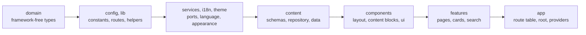
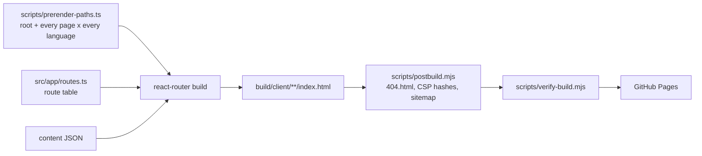
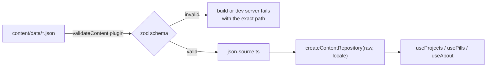

# Architecture

This document explains how my-portfolio-web is structured and why. For individual decisions and their trade-offs, see [decisions.md](decisions.md).

## Principles

| Principle                   | How it shows up                                                                                                          |
| --------------------------- | ------------------------------------------------------------------------------------------------------------------------ |
| Separation of concerns      | Domain types, content, language, configuration, services, presentation and routing live in separate layers.              |
| Dependency inversion        | Pages depend on narrow interfaces (`ProjectRepository`, `PillRepository`, `ContactService`), not on JSON files or a mock. |
| Interface segregation       | Components ask for the smallest hook they need: `useProjects`, `usePills`, `useAbout`.                                    |
| High cohesion, low coupling | Each feature folder owns its pages, cards and search logic and exposes a public API through `index.ts`.                  |
| DRY                         | One hero component, one route table, one constants file, one date formatter, one SEO helper.                             |
| KISS / YAGNI                | A small custom i18n and theme instead of libraries, no global state store, no backend, no data-fetching layer.            |
| Type safety                 | `strict` TypeScript; content types are checked against Zod schemas; dictionaries are checked against the English shape.   |
| Fail fast                   | Invalid content fails the build; unknown render cases fail an exhaustive `never` check; the build verifies its own output. |
| Enforced, not aspirational  | Layer boundaries, unused code, coverage floors, bundle budget and accessibility are checked by tools in CI.              |

## Layers



A layer may import only from the layers to its left. This is not a convention: `eslint.config.js` restricts imports per folder (for example `domain` may import nothing, and `components` may not import from `features` or `app`), and a feature may only be imported through its `index.ts`. The rules run on every commit and in CI; tests and test helpers are exempt.

## Folder responsibilities

| Path                  | Responsibility                                                                                                    |
| --------------------- | ----------------------------------------------------------------------------------------------------------------- |
| `src/domain`          | Types and constants with no dependencies: `Locale`, `Project`, `Pill`, `About`, `ContentBlock`.                    |
| `src/config`          | Constants, the route table (`PATHS`, `localizedPath`), environment access and site identity.                      |
| `src/lib`             | Framework-free helpers: date formatting, text normalization, mailto builder, logger.                              |
| `src/services`        | Ports to infrastructure. Today: `ContactService` with its context and a mock implementation.                      |
| `src/i18n`            | Typed dictionaries, `I18nProvider`, `useRoutes` (localized URLs) and the saved language preference.               |
| `src/theme`           | Theme resolution and the inline script that applies it before first paint, plus the `useTheme` hook.              |
| `src/content`         | Schemas, repository interfaces and implementation, the JSON data and the providers that expose it per language.   |
| `src/components`      | Reusable UI with no knowledge of a feature: layout, content blocks, icons, motion, ui primitives.                 |
| `src/features/<name>` | A vertical slice: its pages, cards and feature logic. Cross-feature use goes through `index.ts`.                  |
| `src/app`             | The composition root: route table, root document, root providers, route modules with their SEO metadata.          |
| `scripts`             | Build tooling: content validation plugin, postbuild, build verification, Pages-like preview, e2e runner.          |
| `e2e`                 | Browser tests that check what a jsdom test cannot.                                                                |

## Rendering and routing

The site is built with React Router in **framework mode** with `ssr: false` and a `prerender` list. There is no server at runtime: `react-router build` renders every page in every language to HTML, and the browser then hydrates it.



The route table (`src/app/routes.ts`) is small:

```text
/                 language chooser; redirects to the visitor's language in the browser
/:lang            layout: language dictionary, content and site frame
  index           home
  projects        list          projects/:slug   detail
  pills           list          pills/:slug      detail
  about, contact
  *               not found inside a language
```

Design points:

- **The URL is the source of truth for the language.** `:lang` selects the dictionary and the content. There is no language state to synchronize, links are ordinary links, and search engines see one URL per language (with `hreflang` alternates).
- **An address without a supported language** (for example `/fr/x`) still matches `:lang`; the layout notices and renders a page that speaks every supported language.
- **Route modules** in `src/app/routes/*.tsx` are thin: they export the page component from a feature and a `meta` function that builds the title, description, canonical, `hreflang`, Open Graph and structured data through `src/app/seo.ts`.
- **No loaders.** Content is part of the bundle, so pages need no data fetching. Prerendering just runs the components.
- **Unknown addresses.** GitHub Pages answers them with `404.html`, which the postbuild step creates from the framework's SPA fallback. It hydrates whatever URL was requested, so a project slug that does not exist renders the localized not-found page, with a real 404 status from the host.

## Content pipeline



1. `scripts/vite-plugin-validate-content.ts` validates all JSON against the schema in `src/content/schema.ts` when the build or dev server starts, and again on every data change in dev. The schema is typed against the domain types so the two cannot drift apart.
2. Because validation happens at build time, the runtime bundle ships the data without a schema library.
3. `createContentRepository(raw, locale)` projects the localized fields and sorts entities newest first. `ContentProvider` rebuilds it when the language changes.

To move content to a CMS or API, implement the repository interfaces and pass the result to `ContentProvider` (its `repository` prop already exists for tests).

## Internationalization

- `domain/locale.ts` lists the supported languages; `i18n/locale.ts` maps them to `Intl` tags and names.
- `dictionaries/en.ts` defines the shape; `es.ts` is typed as that shape, so a missing or extra key fails compilation. A test also checks key parity and empty strings.
- Long-form content is localized inside the JSON, UI strings inside the dictionaries. Neither leaks into components.
- Dates are formatted with `Intl.DateTimeFormat` in UTC so a date never shifts with the viewer's timezone.
- The visitor's choice is remembered (`i18n/preference.ts`) and used only by the site root to pick where to send them.

## Theme

`theme/theme.ts` builds an inline script that `root.tsx` places in `<head>`: it reads the saved choice or the system preference and sets the `dark` class before first paint. `useTheme` reads the DOM as its source of truth (through `useSyncExternalStore`), so the script and the hook can never disagree, and follows system changes until the visitor chooses.

## Security model

There are no runtime secrets: the site is static. The defences are in the output:

- **Content-Security-Policy per page.** GitHub Pages cannot set headers, so `postbuild.mjs` injects a `<meta http-equiv>` policy into every page. Its `script-src` lists the SHA-256 hash of each inline script that page contains (theme script and the framework's hydration data), so it needs neither `unsafe-inline` nor `unsafe-eval`. Other sources are `'self'`; inline styles are allowed only as attributes (`style-src-attr`).
- **No third-party requests.** Fonts are self-hosted and fonts are never inlined as `data:` URIs (the policy refuses them).
- **Content is plain text.** Data is rendered as React text; the code never injects HTML from data.
- `scripts/verify-build.mjs` recomputes the hashes and fails the build if any inline script is not covered, if a page loads a third-party resource, or if a link is broken.

## Error handling and logging

- `root.tsx` and the language layout export `ErrorBoundary` components: errors keep the site frame when a language is known and speak that language.
- `lib/logger.ts` is the only place that touches `console` (ESLint forbids other use), so a reporting service can be added without touching call sites.
- The contact form catches delivery failures, logs them and shows a localized message without losing the visitor's input.
- Unknown routes and slugs render the localized not-found page with `noindex`.

## Configuration

| Concern                       | Location                                                              |
| ----------------------------- | --------------------------------------------------------------------- |
| Tunable numbers and timings   | `src/config/constants.ts`                                             |
| URLs                          | `src/config/routes.ts`                                                |
| Deployment base path, site URL | `VITE_BASE_PATH`, `VITE_SITE_URL` (`vite.config.ts`, `react-router.config.ts`, `src/config/env.ts`) |
| Site identity, storage keys   | `src/config/site.ts`                                                  |

## Testing strategy

| Level        | What is covered                                                                                                               |
| ------------ | ----------------------------------------------------------------------------------------------------------------------------- |
| Unit         | Schema rejection cases, repository, search, formatting, mailto, dictionaries, theme resolution, route paths, SEO metadata.     |
| Component    | Content renderer (every block, escaping, code blocks), theme toggle, language picker, error boundaries.                       |
| Integration  | The real route table rendered in jsdom: language, redirect, 404s, filtering, mobile menu, contact form, links stay in-language. |
| Accessibility | axe on every page in jsdom (structure and ARIA), and in a real browser (colour contrast) in light and dark, both languages.   |
| End to end   | Playwright against the production build behind a base path: CSP, third-party requests, no-JS rendering, 404 status, theme flash, redirects. |
| Build        | `verify-build` checks the prerendered HTML; `check-bundle-size` enforces the first-load budget; Lighthouse enforces score floors. |

Unit tests query by accessible role and name, so they double as accessibility checks. Coverage floors (statements 97, lines 97, functions 97, branches 90) fail the build.

## Performance

- Route chunks are split by the framework; the home page loads about 156 kB of gzip JavaScript and 8 kB of CSS (both budgeted).
- Entrance animations are CSS (`animation-timeline: view()` where supported), not a JavaScript library.
- Fonts are self-hosted variable fonts; only the Latin subsets used above the fold are preloaded.
- Lighthouse (mobile, simulated slow 4G, measured locally): Performance 91–92 with TBT 0 ms and CLS 0.

## Known limitations

- The contact form does not deliver messages until a real `ContactService` is added.
- Every page ships both languages' dictionaries and content (about 20 kB gzip); loading only the active language is on the roadmap.
- Project images are generated placeholders, and the Open Graph image is a generic card: replace both with real assets.
- `robots.txt` cannot be served from the domain root for a project site, so crawlers discover the sitemap through Search Console.
